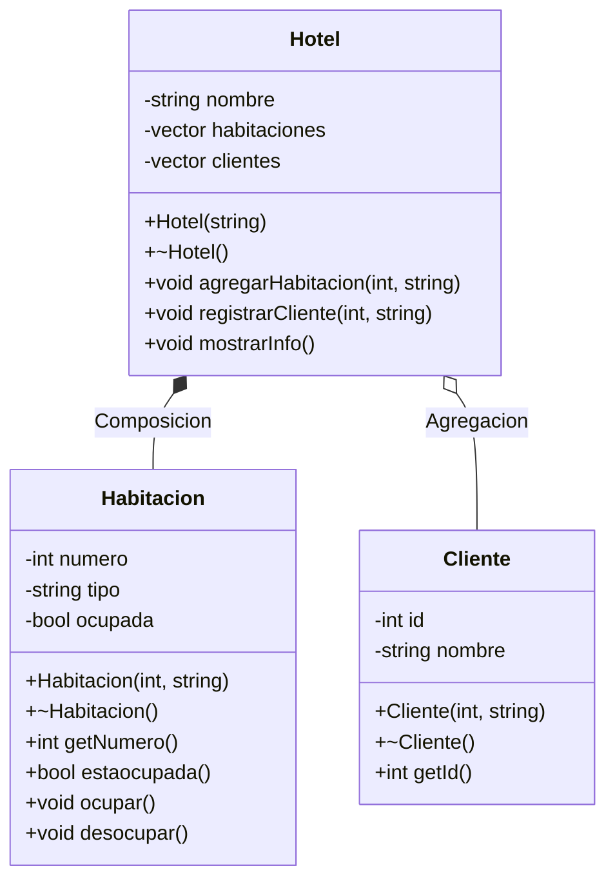

#Solución 1



#Solución 2

```mermaid
classDiagrama
    class Auto{
        -string placa
        -string modelo
        -bool disponible
        +Auto(string, string)
        +~Auto()
        +string getPlaca()  
        +string getModelo()
        +bool estaDisponible()
        +void rentar()
        +void devoler()
    }

    class Cliente{
        -int id
        -string nombre
        +Cliente(int, string)
        +~Cliente()
        +int getId()
    }

    class Contrato{
        -Cliente* cliente
        -Auto* autoRentado
        -int dias
        + Contrato(Cliente*, Auto*, int)
        + ~Contrato()
    }

    class AgenciaRenta {
        - string nombre
        - vector~Auto*~ autos
        - vector~Cliente*~ clientes
        + AgenciaRenta(string)
        + ~AgenciaRenta()
        + void agregarAuto(Auto*)
        + void agregarCliente(Cliente*)
        + void mostrarInfo()
    }
    AgenciaRenta o-- Auto:
    AgenciaRenta o-- Cliente:
    Contrato "1" -- "1" Cliente : asocia
    Contrato "1" -- "1" Auto : asocia

```    

    